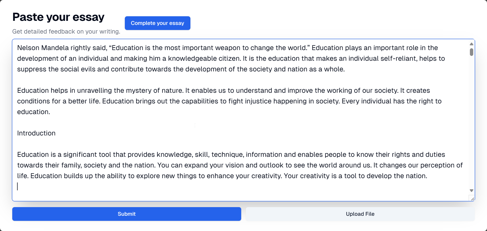

## Automated Essay Scoring System (AESS)

### Overview:

This project tackles the challenges of traditional essay grading by creating an AI-powered system that provides efficient, scalable, and objective feedback to students.

### Tech Stack:

* Frontend: Next.js, React
* Backend: FastAPI (Python)
* Natural Language Processing (NLP): spaCy, Language Tools
* Large Language Model (LLM): Gemini
* Database: MongoDB
* Additional Services: Firebase

### Project Description:

* Students securely login using social accounts (e.g., Google).
* Essays can be uploaded (PDF, DOCX, TXT) or directly typed.
* The system analyzes essays using NLP for grammar, spelling, and readability.
* A Retrieval-Augmented Generation (RAG) model retrieves relevant rubrics (currently hardcoded).
* A Large Language Model (LLM) scores the essay based on rubrics and generates personalized feedback.
* Students receive feedback reports with overall scores, rubric-specific breakdowns, suggestions for improvement, and readability analysis.

### Project Objectives & Scope:

* Automate essay grading to save teacher time and effort.
* Provide objective feedback based on pre-defined rubrics.
* Reduce subjectivity and bias in grading.
* Offer students personalized suggestions for improvement.
* Enhance the efficiency and effectiveness of essay evaluation.

### Technical Challenges:

* Ensuring accurate and unbiased scoring through NLP and LLM.
* Developing a robust RAG model for dynamic rubric selection (future work).
* Integrating the system with existing learning platforms (future work).

### What Was Improved:

* Essay grading efficiency and scalability.
* Objectivity and consistency of feedback.
* Student understanding of strengths and weaknesses in writing.
* Identification and correction of grammatical errors.

### How It Works:

1. Student logs in securely using Google account.
2. Essay is uploaded or directly typed.
3. System analyzes essay using NLP and LLM.
4. RAG model retrieves relevant rubrics (currently hardcoded).
5. LLM scores the essay based on rubrics and generates feedback.
6. Student receives a comprehensive feedback report.

### Customer Satisfaction (Future Work):

* Collect student feedback on the clarity, helpfulness, and accuracy of the feedback reports.
* Analyze feedback to identify areas for improvement.

### Screenshots

**Login Page**

**Essay Upload Page**

**Feedback Report Page**

**Metrics Page**

**Suggestions Page**

**Feedback Page**

**Essay Statistics Page**

---

### Demo Video

<iframe height="315" src="https://www.youtube.com/embed/DeEN5y_ykfU" title="YouTube video player" frameborder="0" allow="accelerometer; autoplay; clipboard-write; encrypted-media; gyroscope; picture-in-picture; web-share" referrerpolicy="strict-origin-when-cross-origin" allowfullscreen></iframe>